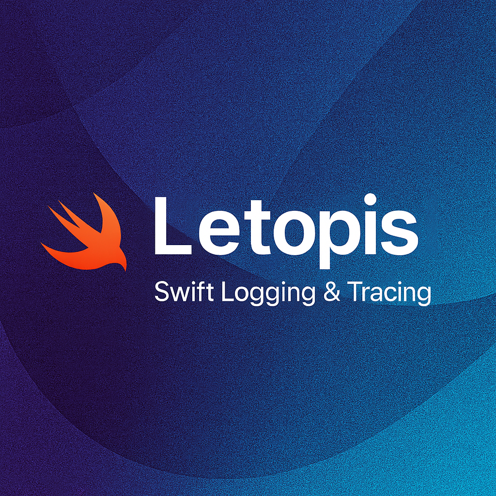

<p align="center">
  
</p>

<p align="center">
  <a href="https://swift.org">
    
  </a>
  <a href="https://swift.org/package-manager/">
    
  </a>
  
  <a href="LICENSE">
    
  </a>
</p>

# Letopis

*Читать на других языках: [English](README.md)*

`Letopis` — это легковесный модуль для логирования и трейсинга, который позволяет описывать события приложения через простой и интуитивный API. Пакет предлагает два подхода: выразительный fluent DSL для создания богатых структурированных логов и прямые методы для быстрого и простого логирования. Все события доставляются через цепочку интерцепторов без внешних зависимостей.

## Ключевые возможности

- **Выразительный DSL синтаксис** — fluent API билдера для создания богатых структурированных событий логирования с метаданными
- **Простые прямые методы** — опциональные прямые методы (`info`, `warning`, `error` и т.д.) для быстрого логирования
- **Единая точка входа для логирования** — один фасад для консоли, сети и аналитики
- **Расширяемая архитектура через интерцепторы** — гибкая фильтрация и маршрутизация событий
- **Гибкое управление сетевым трафиком** — умное буферизование и приоритизация
- **Адаптация к внешним условиям** — динамическая настройка без изменения ядра

## Быстрый старт

```swift
import Letopis

// Инициализируйте логгер
let logger = Letopis(
    interceptors: [ConsoleInterceptor()]
)

// Рекомендуется: Используйте fluent DSL для выразительного структурированного логирования
// Вариант 1: Используйте встроенные домены и действия
logger.log()
    .domain(UserDomain.ui)
    .action(UserAction.click)
    .payload(["screen": "profile", "user_id": "123"])
    .info("Пользователь открыл экран профиля")

// Вариант 2: Используйте строковые домены и действия
logger.log()
    .domain("auth")
    .action("login_success")
    .payload(["user_id": "123"])
    .info("Пользователь вошел в систему")

// Альтернатива: Простой прямой вызов для быстрого логирования
logger.info("Пользователь открыл экран профиля")
```

## Документация

- 📦 [Установка](Docs/ru/installation.md)
- 🚀 [Быстрый старт](Docs/ru/quick-start.md)
- 💬 [LogMessage - Простой API](Docs/ru/log-message.md) — Альтернативный простой подход к логированию
- 📖 [Полная документация](Docs/ru/index.md)
- 📝 [История изменений](CHANGELOG.md)

## Примеры использования

### DSL API (рекомендуется)

Fluent паттерн билдера обеспечивает выразительный цепочечный синтаксис для богатого логирования:

```swift
// Базовое логирование с доменом и действием
logger.log()
    .domain(NetworkDomain.api)
    .action(NetworkAction.start)
    .payload(["endpoint": "/users"])
    .info("Запрос API начат")

// Критичная ошибка с полным контекстом
logger.log()
    .domain(NetworkDomain.network)
    .action(NetworkAction.failure)
    .payload(["endpoint": "/users"])
    .critical()
    .error("Сетевой запрос не выполнен")

// Аналитика со структурированными данными используя строковые домены/действия
logger.log()
    .domain("purchase")
    .action("completed")
    .payload(["item_id": "12345", "price": "9.99"])
    .info("Покупка завершена")

// Отладка с местоположением в коде
logger.log()
    .source()
    .payload(["cache_key": "user_profile"])
    .debug("Попадание в кеш")
// Автоматически захватывает файл, функцию и номер строки

// Чувствительные данные маскируются по умолчанию (с ноября 2025)
// Настройте чувствительные ключи при создании логгера
let logger = Letopis(
    interceptors: [ConsoleInterceptor()],
    sensitiveKeys: ["password", "token", "api_key"]
)

logger.log()
    .payload(["password": "secret123", "username": "john"])
    .info("Пользователь вошел в систему")
// Вывод: password=s***3, username=john
```

### API прямых методов (опционально)

Для быстрого простого логирования без метаданных:

```swift
// Простые сообщения
logger.info("Приложение запущено")
logger.warning("Приближение к лимиту API")
logger.error("Сетевой запрос не выполнен")
logger.debug("Попадание в кеш")
logger.analytics("Покупка завершена")

// С базовой полезной нагрузкой
logger.info(
    "Пользователь вошел в систему",
    payload: ["user_id": "123"]
)
```

## Опциональные хелперы

Letopis включает опциональные вспомогательные утилиты для упрощения распространенных паттернов логирования:

- **`@Logged`** - Property wrapper для автоматического логирования состояния
- **`@LoggedSet`** - Property wrapper только для записи (лучшая производительность)
- **`LogLifecycle`** - Отслеживание жизненного цикла SwiftUI views
- **`logged()`** - Scope-based логирование операций
- **Расширения Publisher** - Поддержка логирования Combine

📖 **[Полная документация по хелперам](Docs/ru/helpers.md)**

## Лицензия

Этот проект лицензирован под MIT License — подробности см. в файле [LICENSE](LICENSE).
