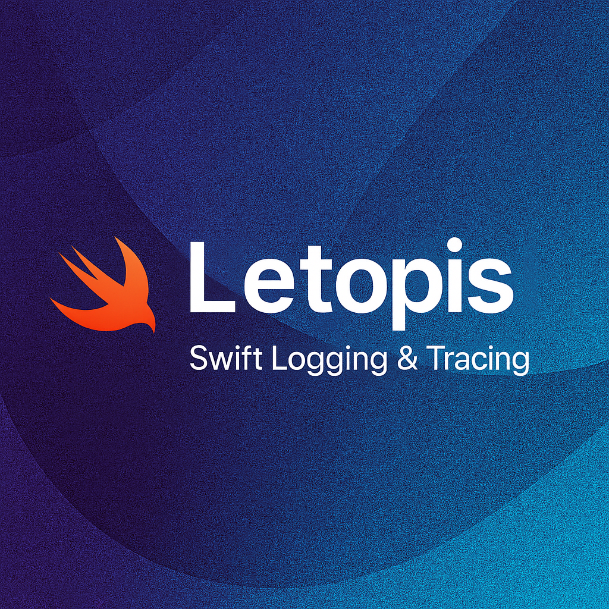

<p align="center">
  
</p>

<p align="center">
  <a href="https://swift.org">
    
  </a>
  <a href="https://swift.org/package-manager/">
    
  </a>
  
  <a href="LICENSE">
    
  </a>
</p>

# Letopis

*Read this in other languages: [Русский](README-ru.md)*

`Letopis` is a lightweight logging and tracing module that lets you describe
application events through a declarative API and deliver them through a chain of
interceptors. The package has no external dependencies, so it can be used from
any layer of your codebase.

## Key Features

- **Unified logging entry point.** The same facade sends events to both console
  and network, while interceptors let you connect any external services:
  analytics systems, monitoring tools, or custom backends. Developers work
  with a unified API without worrying about specific delivery channels.
- **Extensible architecture through interceptors.** Each interceptor can
  encapsulate its own filtering and routing logic, set individual priorities,
  and implement custom message delivery scenarios.
- **Flexible network traffic management.** Network interceptors can analyze
  connection state, decide whether to send events immediately or buffer them,
  and when overflow occurs — redirect data to external storage or libraries
  for deferred processing.
- **Adaptation to external conditions.** The logger dynamically adapts to
  network state and other environmental constraints, with behavior that can
  be finely tuned externally by adding custom interceptors without changing
  the core.

## What other problems can this logger solve:

For example, projects often have a separation between logger and analytics.
And as a result, we see something like this in the code:

```swift
...
    analyticsFacade.sendEvent(.someEvent) // send method to analytics
    logger.log("Sent analytics with event .someEvent")
...
```

So we end up additionally wrapping analytics with logs. Although in fact, these are very similar things.
In this library, we can combine them. Simply extend the logger by adding a corresponding interceptor,
which can be the same facade. Now the developer can save a lot of time by configuring the logger at the beginning.

```swift
    logger.analytics(.someEvent, ...)
```

And then the event goes both to analytics and to the console (if we want) and can be ignored by network loggers.

## Key entities

- **`Letopis`** – the facade that creates events and fans them out to
  interceptors. It accepts an initial array of `LetopisInterceptor` and can be
  extended at runtime through `addInterceptor(_:)`.
- **`Log`** – a builder that lets you describe an event using chained calls
  before dispatching it.
- **`LogEvent`** – a DTO that contains the identifier, timestamp, log type
  (`LogEventType`), priority (`LogPriority`), message, and an additional
  `payload` dictionary.
- **`EventTypeProtocol` / `EventActionProtocol`** – protocols for semantic event
  classifiers. You can create your own types that conform to these protocols.
- **`LetopisInterceptor`** – a protocol for handlers that decide what to do
  with events (send them to the network, persist them, filter them, and so on).

## Quick start

```swift
import Letopis

// Define your own event types
enum AppEventType: String, EventTypeProtocol {
    case userAction = "user_action"
    case apiCall = "api_call"
    case error = "error"
    case system = "system"
}

enum AppEventAction: String, EventActionProtocol {
    case view = "view"
    case fetch = "fetch"
    case networkFailure = "network_failure"
}

// Setup logger with console output for development
private let logger = Letopis(
    interceptors: [
        ConsoleInterceptor(
            logTypes: [.info, .error],
            eventTypes: ["user_action", "api_call", "error"],
            priorities: [.default, .critical]
        )
    ]
)

// Log user interactions
logger
    .event(AppEventType.userAction)
    .action(AppEventAction.view)
    .payload(["user_id": "12345", "screen": "profile"])
    .source()
    .info("User opened profile screen")

// Log API calls
logger
    .event(AppEventType.apiCall)
    .action(AppEventAction.fetch)
    .payload(["endpoint": "/api/users/12345", "method": "GET"])
    .source()
    .info("Fetching user data")

// Log errors with critical priority
logger
    .event(AppEventType.error)
    .action(AppEventAction.networkFailure)
    .priority(.critical)
    .payload(["error_code": "500", "retry_count": "3"])
    .source()
    .error("Failed to load user data")

// This debug event will be filtered out
logger
    .event(AppEventType.system)
    .debug("Internal cache updated")
```

In this example, the console interceptor only shows info and error messages
related to user actions, API calls, and errors. Debug messages and other
event types are filtered out.

## Module API

### `Log` builder

- `action(_:)` / `event(_:)` – set the semantic action and event type. They
  accept any type conforming to `EventActionProtocol` / `EventTypeProtocol`,
  or an arbitrary string literal.
- `payload(_:)` – merges additional key–value pairs into the event payload.
- `priority(_:)` – changes the delivery priority (`.default` or `.critical`).
- `source(file:function:line:)` – records call-site information in the payload.
  By default it uses `#file`, `#function`, and `#line` and stores them under the
  `source_file`, `source_function`, and `source_line` keys.
- `info(_:)`, `warning(_:)`, `error(_:)`, `debug(_:)`, `analytics(_:)` – set the event type,
  message, and immediately create and send the `LogEvent` to all interceptors.
  Errors can be passed directly through `error(_ error: Error, ...)`.

For concise code, you can start a builder from the facade via helper methods
such as `skryzhal.event(...)` or `skryzhal.action(...)`.

### Direct calls

If the builder is overkill, call the facade methods directly:

```swift
// Log successful purchase
logger.info(
    "Purchase completed successfully",
    priority: .critical,
    payload: ["product_id": "premium_plan", "amount": "9.99", "currency": "USD"],
    eventType: .analytics,
    eventAction: .purchase
)

// Log network error
logger.error(
    "Network request failed",
    priority: .critical,
    payload: ["url": "https://api.example.com/data", "status_code": "404"],
    eventType: .error,
    eventAction: .networkFailure
)
```

Equivalent overloads exist for `warning`, `debug`, `analytics`, and both versions of
`error` (accepting `String` or `Error`). Every method accepts optional
`payload`, `eventType`, and `eventAction` arguments that are merged into the
final payload.

### Custom event types

You can create your own event types by conforming to the protocols:

```swift
enum CustomEventType: String, EventTypeProtocol {
    case authentication = "auth"
    case dataSync = "data_sync"
    case featureFlag = "feature_flag"
}

enum CustomAction: String, EventActionProtocol {
    case enable = "enable"
    case disable = "disable"
    case refresh = "refresh"
}

// Use them with the logger
logger
    .event(CustomEventType.authentication)
    .action(CustomAction.enable)
    .info("Two-factor authentication enabled")
```

### Integration example

When creating a package or application with Letopis as a dependency, you can define your own event types and actions for your specific domain:

```swift
import Letopis
import Foundation

public enum ScreenAction: String, EventActionProtocol, Sendable {
    case open
    case close
}

public enum AppEventType: String, EventTypeProtocol, Sendable {
    case uiAction = "ui_action"
    case businessLogic = "business_logic"
}

@main
struct LetopisDemo {
    static func main() {
        let logger = Letopis(interceptors: [ConsoleInterceptor()])

        logger
            .event(AppEventType.uiAction)
            .action(ScreenAction.open)
            .payload(["screen_name": "MainViewController", "user_id": "12345"])
            .source()
            .info("User opened main screen")

        logger
            .event(AppEventType.businessLogic)
            .payload(["operation": "data_sync", "records_count": "150"])
            .source()
            .info("Processing user data")

        // Give time for processing and output of logs
        Thread.sleep(forTimeInterval: 2.0)
    }
}
```

This approach allows you to create domain-specific event taxonomies that make sense for your application while leveraging Letopis's flexible logging infrastructure.

## Advanced examples

### Network interceptor with caching

For a complete example of how to implement a network-aware interceptor with caching and connectivity monitoring, see [`Demo.swift`](Sources/Letopis/Examples/Demo.swift). This example demonstrates:

- **Thread-safe actor-based interceptor** that handles network logs
- **Smart caching** that stores logs when offline and processes them when connectivity returns
- **Priority-based handling** where critical logs are sent even in poor network conditions
- **Network state monitoring** with different behaviors for online, offline, and poor connectivity
- **Real-world scenarios** including server failures and retry logic

The demo shows how to build production-ready interceptors that adapt to changing network conditions while maintaining data integrity and user experience.

## Interceptors and extensibility

### Base protocol

To conform to `LetopisInterceptor`, implement a single method,
`handle(_ logEvent: LogEvent)`. Once invoked you can:

- process the event synchronously or asynchronously;
- drop it if it does not match your rules (for example, filter by type,
  priority, or metadata);
- transform the payload and forward it to another system.

### Console interceptor

`ConsoleInterceptor` is a ready-to-use implementation that can filter events by
log type, priority, semantic values, and source file. Filters are provided as
arrays that are normalised into sets. The interceptor formats events into a
string and prints it using a `Printer` closure (defaults to `print`). Printing is
executed on the `LoggingActor` global actor to keep console output serialised.

> ℹ️  The `sourceFiles` filter looks for the `source_file` field in the payload,
> which stores the source file name, and matches it against the provided list.
> Builders that assemble a custom payload can populate this key manually when
> needed.

In non-`DEBUG` builds `ConsoleInterceptor` short-circuits and suppresses output.

### Custom delivery targets

To add a new delivery channel:

1. Create a type that conforms to `LetopisInterceptor`.
2. Decide which events you want to handle (for example, `priority == .critical`
   for immediate uploads).
3. Implement the backing infrastructure: network client, file manager, or
   database layer.

A simplified network interceptor might look like this:

```swift
final class AnalyticsInterceptor: LetopisInterceptor {
    private let analyticsService: AnalyticsService

    init(analyticsService: AnalyticsService) {
        self.analyticsService = analyticsService
    }

    func handle(_ logEvent: LogEvent) {
        // Only send analytics and user action events
        guard let eventType = logEvent.payload["event_type"],
              ["analytics", "user_action"].contains(eventType) else { return }
        
        let analyticsEvent = AnalyticsEvent(
            name: logEvent.message,
            properties: logEvent.payload,
            timestamp: logEvent.timestamp
        )
        
        analyticsService.track(analyticsEvent)
    }
}
```

The same approach works for disk persistence (e.g. writing JSON) or databases
(Core Data, Realm, SQLite, …). Each interceptor encapsulates its own storage and
retry policy so you can compose them freely.

## Event prioritization

`LogPriority` defines two levels:

- `.default` – regular events that can be buffered or sent in batches.
- `.critical` – events that require immediate handling (failures, critical
  analytics).

Each interceptor can interpret priorities differently. Examples:

- a network interceptor may send critical events immediately and queue others;
- a disk interceptor may persist everything but only trigger background syncs
  when a critical entry appears;
- the console interceptor can print only high-priority messages, hiding noise.

This keeps prioritization outside of the core and lets every delivery channel
follow its own rules.

## Combining interceptors

`Letopis` supports multiple interceptors at once, allowing you to mix and match
handlers per environment:

```swift
// Production setup with multiple delivery channels
let logger = Letopis(
    interceptors: [
        ConsoleInterceptor(logTypes: [.error]), // Only errors in console
        AnalyticsInterceptor(analyticsService: mixpanel), // User events to analytics
        CrashReportingInterceptor(crashlytics: crashlytics), // Critical errors to crash reporting
        LocalStorageInterceptor(storage: coreDataStack) // All events to local database
    ]
)

// Development setup
#if DEBUG
let devLogger = Letopis(
    interceptors: [
        ConsoleInterceptor() // All events to console for debugging
    ]
)
#endif
```

Calling any logging method (`info()`, `warning()`, `error()`, `debug()`, `analytics()`) creates
an event that is forwarded to each interceptor in turn, so adding a new delivery
channel does not require touching existing ones.

## Adoption tips

- Keep payload keys consistent across interceptors (for example,
  `event_type`, `event_action`, `source_*`).
- Use enums with `String` raw values to describe event types and actions in a
  type-safe way.
- Place concrete interceptor implementations (network, files, database) into
  separate modules or layers for better modularity.
- Cover interceptors with tests. `LetopisTests` contains an example of a spy
  interceptor that verifies event delivery.

Use this documentation as a starting point and tailor `Letopis` to your
project’s needs by adding custom interceptors and delivery policies while
keeping the logging interface consistent.

## License

This project is licensed under the MIT License — see the [LICENSE](LICENSE) file for details.
